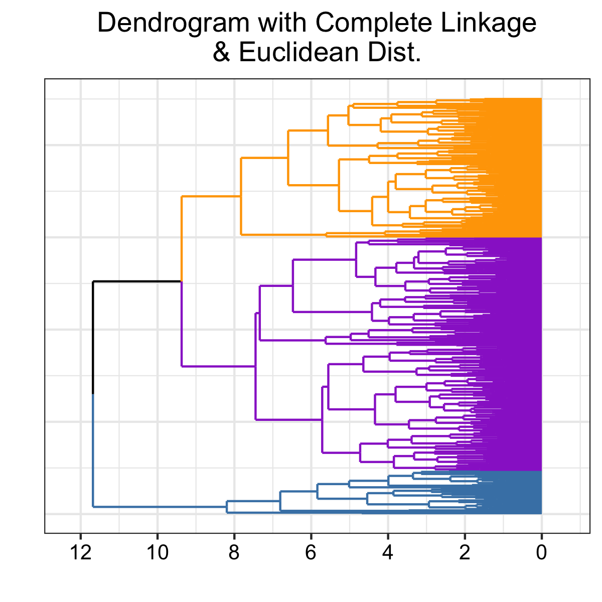

Clustering Baseball Players
-------
*Please email
<a href="mailto:remmertjack@gmail.com" class="email">remmertjack@gmail.com</a>
for any questions, comments, concerns, or discussion points about the analysis presented within.*

### *Abstract*
The aim of this study was to identify the different hitting styles of players in the MLB.  A total of 450 players were sampled from 2015-2019 given they had at least 400 total PA, 100 PA in 2018 and 125 PA in 2017 to account for the survivorship basis and issues with identifying aging player's hitting styles.  These sub-groups were determined using four different types of Cluster Analysis: K-Means, K-Medoids, Hierarchical Clustering, and Gaussian Mixture Models.  Players were clustered on their BB%, K%, and Quality of Contact %, similar to Statcast's similarity measures for an initial comparison.  Upon applying the various algorithms, K-Means and K-Medoids both found 2 hitters, while Hierarchical Clustering and Gaussian Mixture Models showed 3 different types of hitters.  These types of hitters were labeled as Power-Hitters and Table Setters, with the third group as Platoon in the case of Hierarchical Clustering and Gaussian Mixture Models.  Scouts and analysts can utilize them to determine a hitter's profile objectively and find suitable replacements for batting roles for upcoming trades.

### Table of Contents
1. [Introduction](#introduction)
1. [Data](#data)
1. [Clustering Methods](#clustering-methods)
1. [Results](#results)
1. [Visualizing and Discussing Clusters](#visualizing-and-discussing-clusters)
1. [In the Future](#in-the-future)

Introduction
----

Over the years, I have listened to many baseball commentators talk about
hitters as they come up to the plate. With statements such as ‘He is a pull hitter.’, ‘He hits for power!’, ‘Gets on base a lot.’, ‘Rarely strikeouts, puts the ball in play’, a commentator utilizes a player’s profile to help guide fans. On the other
hand, scouts tend to look for five qualities in players: Running Speed,
Throwing Strength, Defensive skills, Hitting for Average, and Hitting
for Power. Thus, a logical question is - what qualities determine these
types of hitters and who else is comparable to them?

If you think this question sounds similar to [Statcast’s
similarity measures](https://baseballsavant.mlb.com/affinity-pitchersAndHitters-byHittingProfile#players=hitters&player=545361-R&s=0.5), 
it is. In my case, I want to find different groups or styles
of players, whereas Statcast is interested in finding how similar
players are to one another. Although analyzing similarities between two players is good, we still do not have a way of contextualizing 
players. For example, according to Statcast, Mike Trout’s most similar
player (in 2019) is Yordan Alvarez whereas DJ LeMahieu’s is Robinson
Cano. Does that mean the Yankees in 2019 would want Cano hitting where
LeMahieu was or the Angels should look at Alvarez more closely if they
ever need a replacement batter? Potentially. But wouldn’t a better
question be what type of Hitting Style do Trout and LeMahieu posses? If
a team needs someone to hit for power, who should they look to acquire?
Similarity measures cannot fully answer either of these questions. It
can tell a team who would be the most similar replacement, but not what
exactly are they trying to replace or acquire. Additionally, just because a player
is a suitable replacement, does not mean they would be the best for the
job. A team looking to replace an average player may replace them with
another average player, but would it not be more beneficial to replace
them with a player that fits the desired role more closely and ideally
cheaper?

Thus, instead of analyzing how similar two players are, we
should attempt to group them. In order to do this, I will use a method
called Cluster Analysis (CA), an unsupervised learning method, where
researchers attempt to find similar groups between observations.

Data
----

An original total of 548 players were sampled given they had a minimum
of 400 PA between 2015-2019. This dataset was further refined to remove
players who had less than 100 PA in 2018 and less than 125 PA in 2017.
This reduction process was implemented to account for any survivorship
basis and player’s missing time due to injuries. Some additional players
were included such as Miguel Andujar, Travis Jankowski, Preston Tucker,
Ryan Flaherty, Bobby Wilson, Peter Bourjos, and Rene Rivera.
Additionally, some players did retire in the timeframe like A.J. Ellis, but were included as there was no efficient way to check them other than a manual search.
While this favors players who have played
more recently, given Statcast’s Expected Stats and Quality of Contact
only goes back to 2015, I did not think it correct to evaluate an aging
player’s last few years. I could have decomposed each year of a player’s
performance, but Statcast does not like it when you load a lot of data. Thus, the total sample size of players was 450.

For part 1 of this analysis, I clustered players on their BB%, K%, and
Quality of Contact rates using a few different methods. In the future, I
plan on incorporating more variables such as direction and production.
All data was compiled with Statcast’s search function and FanGraphs,
which are both free to use.

Clustering Methods
------------------

There are many ways to cluster observations, but I think the most
popular methods are K-Means, K-Medoids, Hierarchical Methods with
dendrograms, and Gaussian Mixture Models. K-Means and K-Medoids
partitions *n* observations into *k* clusters, where each observation
belongs to the cluster with the nearest mean/median. A dendrogram is a
tree diagram that shows a hierarchical relationship between objects.
From this hierarchical relationship, we can determine the clusters by
analyzing which players group together under a hierarchy. I
think whenever we classify anything, one observation will probably be a
mixture of the groups. For example, although Trout is in his own world
according to Statcast, I suspect there exists players who hit for
power, get on base, put the ball in play, etc. Each player has some of
those qualities, hence Gaussian Mixture Models (GMM). GMM are
probabilistic models that are able to represent sub-groups within a
population; however, they also provide a probability an observation is
from a sub-group. Therefore, in my opinon, they can better answer the question
of how to contextualize players.

***For those interested in the details for each method, the following
section will be beneficial. For those looking for the results,
feel free to skip to the Results section.***

#### K-Means and K-Medoids

K-means assigns observations to clusters to minimize the within-cluster
variances, which are the squared Euclidean distances. First, we specify
the number of clusters, then randomly select a number of observations as
the initial cluster centers. Next, we assign each observation to a
cluster based on the Euclidean distance between the observation and the
centroid and update the cluster centroid with the
new mean. Lastly, we iterate and assign each observation to a cluster,
updating the cluster centers until we have minimized the total
within-cluster variances. The more general method is K-Medoids, which
minimizes the sum of dissimilarities between points labeled to be in a
cluster and a point designated as the center of that cluster in the same
general process. K-Medoids tends to be non-sensitive to
outliers and reduces noise versus K-Means because it uses the median
rather than the mean. Furthermore, in contrast to the K-means algorithm,
K-Medoids chooses datapoints as centers.

For K-means, I leveraged R’s NbClust package, which evaluates a
different number of clusters over 26 different cluster indices and picks
the optimal classification based on the majority rule. I evaluated 2-30
clusters. This is primarily because people agree that there are different
types of hitting styles, but do not agree on the exact number. For
example, Gary Huckabay believes there are 26 distinct aging curves each
applying to a different type of player. This prediction of 26, which comes with a lot of experience and art, is still subjective.

For K-Medoids, I implemented it with the Partitioning Around Medoids
(PAM) algorithm and the number of clusters was evaluated using the
Silhouette Index as is best practice.  Instead of using
Euclidean distance, I used the Minkowski distance with *p* = 0.34. The Euclidean distance is actually a generalized version of the
Minkowski distance with *p* = 2 for those that know the equation. “Why
0.34?”, do you ask, well that specific value provided the maximum
average silhouette value for my clusters in testing.

#### Hierarchical Methods

Hierarchical Clustering builds tree diagrams that show some hierarchy.
Similar to an organizational charts with a CEO at the top and the different
departments below them. The approach to creating these tree diagrams, or
dendrograms, are either top-down, “Divisive”, or bottom-up,
“Agglomerative”. In top-down, we start with 1 cluster and try to split
the observations as we move down, while bottom-up is the reverse,
everybody is in their own cluster and we move up the tree grouping
observations. For Hierarchical Clustering (HC), there are two main parameters
to adjust: the distance metric and the linkage method. The distance
method will measure how far or close the points are in some *n*
dimensional space and the linkage method describes the process in which
we form the clusters. For simplicity, I used the Euclidean distance and
the Complete linkage, an agglomerative method.

Distance metrics are extremely important for our data
and some linkage methods require a certain distance in order to be
*“correct”*. Also, the choice of distance metric can be fairly important
from a data perspective. Consider the case of clustering shoppers based
on their past shopping history in terms of the number of each good they
bought. If we used Euclidean distance, shoppers that did not buy a lot
of items would be clustered together and shoppers that did buy a lot
would be in another cluster. But instead, if we used a correlation-based
distance metric, then shoppers with similar preferences would be grouped
together. In this case, we are analyzing  players based on their percentages to control for playing time, we do not need to use a correlation-based distance metric. If we analyzed the raw Ks or BBs, as in how many Ks or BBs a player had in their career, then we would want to use
correlation-based distance metrics.

There are 4 main linkage methods: Complete, Single (Nearest
Neighbor), Average, and Centroid. Complete and Average tend to produce
more balanced dendrograms and they seek to first compute the pairwise
dissimilarities between two observations, then record the largest
(Complete) or average (Average) of these dissimilarities. Single linkage
is the opposite of Average and Complete, it combines the closest pair of
elements not yet belonging to the same cluster. Lastly, Centroid linkage
tends to be used in genomics.

Therefore, in order to determine the number of clusters for Hierarchical
Clustering, I leveraged NbClust once again, but this time using Complete
Linkage as the method instead of K-means.

#### Gaussian Mixture Models

GMM are a mixture of Gaussian probability distributions. A Gaussian
distribution is essentially a bell curve with a certain mean and variance. The probability
density function for the mixture is a linear combination of these
individual distributions. For example, in Figure 1, we have two Gaussian
distributions, *x1* and *x2* in orange and their mixture model in blue.
In 2 dimensions, with different variables, we have something that looks
similar to the contour lines on a map, Figure 2.

GMM assume there are a certain number of Gaussian distributions, which
each representing a cluster, with corresponding mean and covariance. Formally,
for a given set of data points, *X*, we have a mixture of *k* Gaussians; however, the question becomes, how do we determine the mean and
covariance, the parameters, for each Gaussian? In order to find these
parameters, we seek to maximize the likelihood that *X* is most
probable. In layman’s terms, we find the probability density function
that best fits the dataset. In order to do this, we use the
Expectation-Maximization (EM) algorithm.

The EM algorithm in GMM is an iterative process. First, we assume we
have *k* clusters. Then we need to calculate the parameters for each of
these clusters, remember they are Gaussian distributions, as follows:

-   *Expectation Step*: First, for each observation, *x**i*,
    we calculate the probability it belongs to some cluster
    *c*1, *c*2, ..., *c**k*.
-   *Maximization Step*: Based on the probability, we then update the
    parameters for the mean, covariance, and density of each cluster.

This process repeats until we have maximized the likelihood.

Additionally, each cluster has certain geometric features, such as the
shape/spread of the density contours, volume of the cluster (number of
objects in a cluster), and orientation, which are determined by their
covariance matrix and a distribution structure type, such as spherical,
diagonal, or ellipsoidal. These distributions can be described and
visualized in the following ways:

-   Spherical: circular contour lines, cone like structure
-   Diagonal: circular contour lines but stretched in a coordinate
    direction, *x* or *y*
-   Full/Ellipsoidal: circular contour lines but stretched in multiple
    directions

For the Spherical distribution, there are 2 models because they can have
either equal or variable volume. Their shape is the same in either
direction and the orientation is indifferent because they are a circle,
a circle rotated on a 2D plane results in the same circle. There are
4 models for diagonal distributions, they each can have equal or
variable volume and shape orientated on the coordinate axes. Lastly,
there are 8 models for the ellipsoidal case, and the clusters can have
equal or variable volume, shape, and/or orientation.

To implement GMM, I used mclust in R, as we can test a range of possible
clusters and compare them with the Bayesian Information Criterion, BIC.
The main benefit here is when fitting models, it is possible to increase the likelihood by adding more
parameters, but this may result in overfitting. Thus, BIC introduces a
penalty term for the number of parameters and when measuring, the lower
the BIC, the more optimal the model. That said, in mclust, BIC is
calculated in reverse because the number of clusters is not considered
an independent parameter for calculating BIC. Thus, we are maximizing
the BIC when using this package. I am going to skip the details as to
what exactly is going on under the hood here because they are not totally
important in this study, but a good explanation can be found on
[Cross-Validated](https://stats.stackexchange.com/questions/237220/mclust-model-selection).
This type of process, maximizing a value when we generally minimize it,
is also found in other processes like sklearn’s cross validation package
with regression and Mean Square Error, for those curious.

Results
-------

#### K-Means and K-Medoids

When using K-means and NbClust, 2 clusters were determined to be the
optimal number based on the majority rule. Similarly, when implementing
K-Medoids, 2 clusters were also determined when using the Silhouette
Index as the validation index.

#### Hierarchical Analysis with Dendograms

When clustering using Complete linkage and Euclidean distance, 13
indexes determined 3 clusters as the optimal classification and
presented the following structure.

#### Gaussian Mixture Models

Upon implementing GMM, mclust tested each model using a range of 1-10
clusters. From this analysis, the optimal number of clusters was 3 and
they were Ellipsoidal with variable volume, shape and equal orientation,
VVE.

Visualizing and Discussing Clusters
-------

With these clustering objects, we can visualize the clusters in their 2D
space and their statistical profile using radar charts. We already
visualized the results of the HC method above as the dendrogram.

Most noticeabe is the amount of variance that is explained in the
dimensions. Using Euclidean distance in K-Means and GMM, we
only explained 56% of the data in 2D, whereas when we changed to the
Minkowski distance, we were able to explain 62% of the variance. Overall
this is not a tremendous amount within our dataset, and some believe it
should be at least 60%. In order to look at the variables that accounted
for the most variance, we can look at a biplot of the variables, using Euclidean distance. Here we
see that Weak% and Flare% do not contribute all that much to the
underlying clusters, as in they are not good differentiators, and may be potential
variables to remove.

For those that are observant, you can see that K-Means and GMM explain the
same amount of total variance in 2D, with K-Medoids explaining a little more.
K-Medoids is higher because we used a different distance metric.
GMM is the same because K-means is in fact a special case of EM for GMM
that assumes a hard assignment (no probabilities) and the identity
matrix is used for the covariance. Thus, we are operating in the same
dimensional space for both GMM and K-Means.

In analyzing the 2D plots, the question are: Does the dataset contain meaningful clusters, as in
a non-random structure or not? We call this assessing cluster tendency.
To test, I used the Hopkins statistic. In implementing this test, we are
testing the alternative hypothesis that the dataset is not uniformly
distributed and if *H* &lt; 0.5, then it is unlikely we have
statistically significant clusters. Thankfully, when I ran it on this
dataset, I had *H* = 0.73, thus we have clusterable data.

With these clusters, it always useful to label them and show their
centers. For K-Means and K-Medoids, I decided to call the two clusters
Power-Hitters and Table-Setters. However, in HC and GMM Clustering,
where we found 3 clusters, I called the third cluster Platoon players.
From a profile view, Power-Hitters are fairly straightforward. Those
players have lots of Barrels and Solid contact rates, they tend to
Strikeout and Walk more. On the other hand, the Table-Setters tend to do
the opposite, they hit more Topped balls. Therefore, they do not have the
power to turn those Topped balls into Solids or Barrels. They may get on
base, but tend to hit for singles rather than extra bases I suspect.

For the Platoon players, they fit somewhere in the middle of that. In
the case of HC, the main difference is that they Walk the same amount
as Table-Setters, but get the same number of Strikeouts, Barrels, and
Topped. For GMM, accounting for the variance between the variables,
these Platoon players perform very differently than their cohort in HC.
They do not Barrel the ball as much as the Table-Setters, but they
Strikeout at a similar rate as Power-Hitters and have a similar number
of Topped balls and Walks as Table-Setters. These are the players, to
me, tend to not play frequently because they do not offer the same level
of consistency as the other two groups. They may suffer from not having
the same amount of playing time, thus there is probably more variance
within this group.

Probably the question that people care about is: Who are in these
groups? The full output is in the Cluster Results section of this repository. The results can be controversial, 
and the names themselves are subjective
The names were informed by the radar charts, not from the players within them. Honestly, I am
happy with the names for K-Means, K-Medoids, and GMM, but not the HC
method. HC had a different number of observations per cluster versus all
the other methods. Additionally, the names within the HC groups did not
always make sense. For example, Mookie Betts and Manny Machado were both
classified as Platoon players, but in the three other methods they were
Table-Setters or at least a mix between Table-Setters and Power-Hitters,
never Platoon. That does not mean this analysis is incorrect, Cluster
Analysis is subjective, but not even I like HC. I called them
Platoon because we are not looking at defensive metrics, thus it would
be inadequate to call them Defensive Specialists. If somebody has a better
name for them, in the HC case, please by all means suggest it.

For simplicity, I will only discuss some of the GMM results within
here. I am happy to discuss all the results through email and I have posted
my contact information below. In terms of a Top 5 from each category, both the
Power-Hitters and Platoon players had players in the Top 5 with 100%
classification, meaning they are only this type of player. To no
surprise, Joey Gallo, Mike Trout, Aaron Judge, Giancarlo Stanton are
the top 5 Power Hitters, with Jake Cave rounding it out. For the Platoon
players, Billy Hamilton, Bradley Zimmer, Travis Jankowski, Delino
Deshields, and Jarrod Dyson are the Top 5. For the Table-Setters, none
of them are 100%, but they are all above 99.5%. These players are Daniel
Murphy, Jeff McNeil, Yuli Gurriel, Michael Brantley, and Yadier Molina.

However, the best part of Gaussian Mixture Models is the probabilities.
For example, Brian Goodwin was a 39%/35%/26% player in terms of
Table-Setter%/Power-Hitter%/Platoon%. There is ambiguity about his style
of hitting. This is a good thing! Yes, we all agree that Trout, Judge,
Stanton, etc. are Power-Hitters. But can someone honestly tell me what
type of hitter Brian Goodwin is? If we used K-Means or HC, we would have
said he is a Power Hitter or Platoon respectively, but there is a good portion of him that could
also be a Table-Setter. My point is, when we are doing some
subjective analysis like clustering, the results need to have
probabilities attached to them.

Conclusions
-------

Hopefully, this work shows first and foremost there are other methods
besides K-Means that work and, in my opinion, are much better, as they leverage both mean and the covariance. 
Too frequently, I see budding analysts apply K-Means by picking 
a subjective number of clusters and proceeding with their analysis. 
It would be beneficial to think more in terms of probabilities.

Finally, the main reason we are all here: Are there two, three, or
26 different types of hitters? Based on my analysis, I would argue there
are three different types of hitters. We could assume there are two, but
I prefer to think of my results also in terms of a batting-order. For
spots 1 and 2, a team tends to have Table-Setters. For spots 3-6,
Power-Hitters. Then 7, 8, and 9, tend to be either the pitcher in the NL
non-COVID season, your more Platoon and Defensive players, or someone
who is very fast. Having only two different types of hitters is too simplistic, 
whereas three types of hitters
is something that we see every day. There might have been a time when we had 26 different 
types of hitters, but over time with teams focusing on analytics, many types of
hitters have fallen out of favor.  Also, Huckabay argued there were 26 different aging curves,
but he did not specify if they were hitting aging curves.
Therefore, we have Power-Hitters, Table-Setters, and Platoon Hitters in the game today.

### In the Future…

For Part 2, I would like to incorporate more variables such as Pull%,
Center/Straightaway%, Opposite%, and also measures of production
such as xBA, xISO, xwOBA. This way we could know more objectively the
difference between a Table-Setter and a Power-Hitter. I do believe that
a combination of these variables will provide *“better”* groupings and
explain more the of the dataset rather than 56%.

Additionally, I am going to take a deeper dive using dimensionality
reduction techniques to analyze the variables more thoroughly. As we saw
in the radar charts and biplot, Weak% and Flare% did not provide a good
differentiator. Every group had roughly the same percentage.

In terms of clustering methods, I am leaning towards only focusing on
GMM. I prefer soft-clustering methods because
we can have conversations about players that can be a combination of all
groups. Hard-clustering methods state an observation is in this cluster,
hence stating a player is only this type of player. Although that may be
useful for commentators that are hedgehogs, I prefer to be a fox
(see Nate Silver's hedgehog vs fox analogy). Players can have aspects from
multiple groups.

### Comments and Questions?

Please email
<a href="mailto:remmertjack@gmail.com" class="email">remmertjack@gmail.com</a>
for any questions, comments, concerns, or discussion points about the
analysis.
